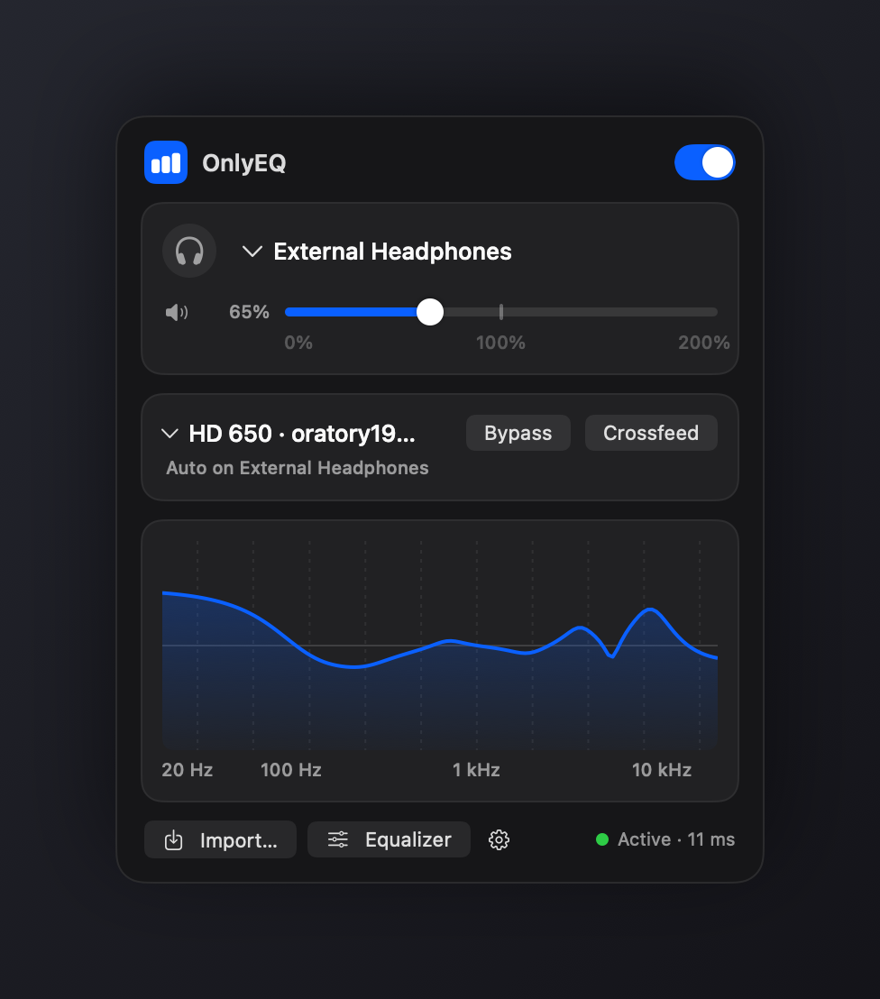
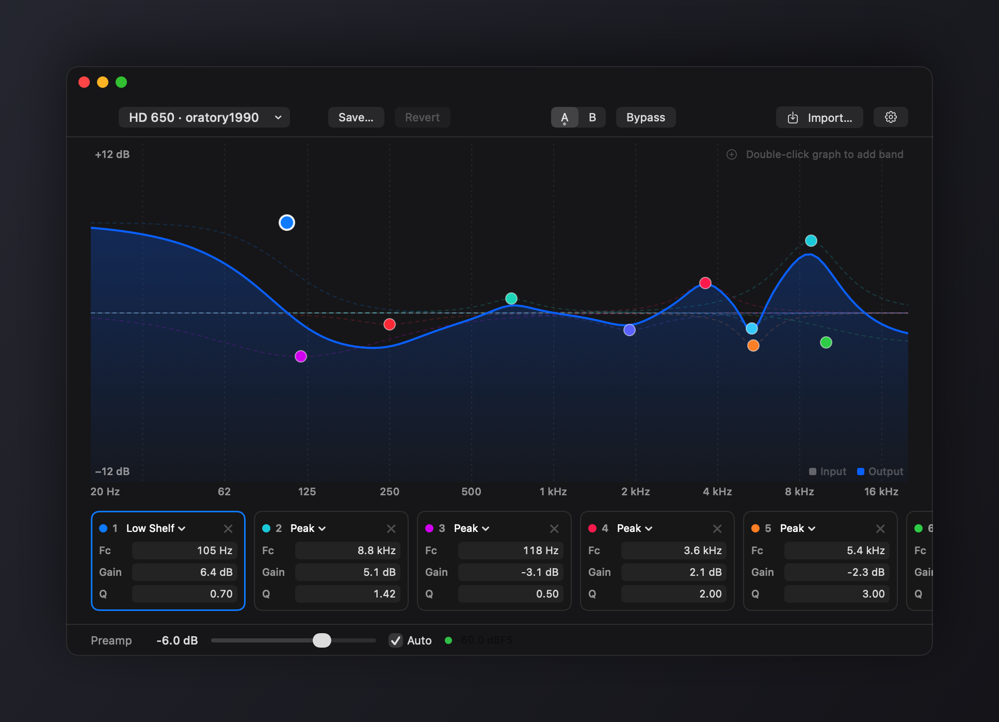
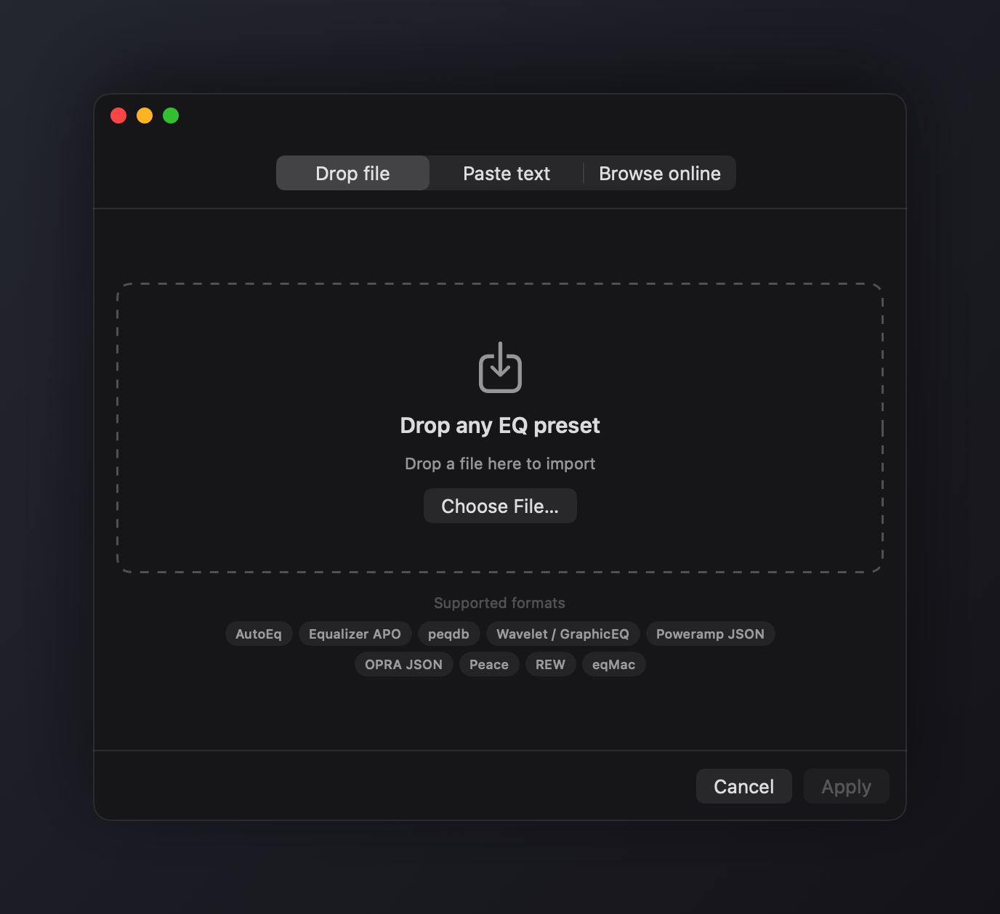

<p align="center">
  
</p>

# OnlyEQ

System-wide parametric EQ for macOS. Lives in the menu bar. No virtual audio drivers.

Every Mac EQ I tried either made me install BlackHole or a HAL driver, charged for parametric bands, or buried a simple job under a complicated UI. OnlyEQ instead uses the process tap API Apple added in macOS 14.4: it taps the system output mix, runs it through biquad filters, and plays the result back to your output device. Nothing to install, no password, no coreaudiod restarts, and your volume keys keep working. Adds about 10 ms of latency at the default 256-frame buffer (configurable from 128 to 1024 in Settings — this is fine for music and video; for latency-critical monitoring in a DAW, add the DAW to the exclude list instead).

## Changes in this fork

This is a fork of [zollans/OnlyEQ](https://github.com/zollans/OnlyEQ). Everything below was added here and is not in the upstream app.

**Listening**

- **Bypass instead of Flat.** The popover's Flat button and its hotkey silently overwrote the active preset with a flat curve, and the previous preset could only be recovered by importing it again. Both now toggle Bypass, which leaves the preset untouched.
- **Level-matched bypass.** Bypass keeps the preamp, output gain, and limiter active and skips only the filter bands, so an A/B comparison is not decided by the unprocessed side being louder.
- **Crossfeed** for headphones (Bauer-style: 700 Hz low-pass, 0.3 ms delay, adjustable feed level). Toggle in the popover and the editor, amount in Settings › Sound.
- **Loudness compensation** following the ISO 226 equal-loudness contours: low and high shelves grow as the volume drops below a reference level you set, and the preamp absorbs the boost so nothing clips.
- **Settings inside the editor.** The gear in the editor toolbar or popover switches the editor window to a Settings pane; there is no separate settings window.
- **Releases from GitHub Actions.** Every push runs the self-tests and builds the universal app in release mode. Pushing a `v*` tag signs the archive with this fork's Sparkle key and publishes it with its appcast as a GitHub Release, which installed copies pick up automatically. Upstream's feed is no longer used, so an upstream release can never replace a fork build.
- **Input and output spectrum.** The analyser draws the pre-EQ signal in grey behind the post-EQ signal in the accent colour, level-aligned for preamp and output gain, so the EQ's effect is visible on real music. Bars show band power (a full-scale sine reads 0 dBFS), tilted 2 dB per octave so typical music reads flat instead of bass-heavy, with a 10 ms attack and 400 ms release so transients register without flicker. Bars below about 300 Hz read from a 16384-point FFT and the rest from a 2048-point one, so bass has real resolution without smearing transients above.
- **Simpler controls.** The popover has one preset row with Bypass and Crossfeed side by side, a curve that flattens while bypassed, and a gear menu holding Settings, Check for Updates, and Quit. The right-click menu offers the same items. The editor's Reset-to-flat button is replaced by Revert, which restores the saved preset, and the output-device picker lives only in the popover. Settings gains a Sound tab for the limiter, crossfeed, and loudness.
- **Matched biquads.** Filters use Vicanek's matched second-order design instead of the bilinear transform, so peaks and shelves near 20 kHz keep their intended shape and a preset measures the same at 44.1 kHz and 96 kHz.

**Presets and import**

- Applying an imported or searched preset saves it, so it stays in the preset picker instead of disappearing on the next switch.
- Filter lines without a `Gain` term (Equalizer APO, REW, and AutoEq write LP, HP, BP, and notch lines this way) import instead of being dropped.
- An undecodable `presets.json` or `profiles.json` is moved aside as `<name>.corrupt-<timestamp>` instead of being overwritten with an empty file.
- Saving a preset under an existing name keeps the menu checkmark and the next-preset hotkey in sync.

**Fixes from a whole-codebase review**

- The render thread no longer allocates or frees memory when the band count or the filter snapshot changes.
- Excluded apps launched after the tap was created are now excluded, without waiting for a device change.
- Typed band values are clamped to the canvas range, and a frequency shown as "1.5 kHz" edits as 1500 rather than 1.5 Hz.
- Concurrent online database loads no longer race, and the import sheet cancels stale parse and preview work.
- Cmd-A/C/V/X/Z/W in the editor work on Cyrillic, Greek, and Hebrew keyboard layouts.

## Install

```sh
curl -fsSL https://raw.githubusercontent.com/maltemoeser/OnlyEQ/main/scripts/install.sh | bash
```

The app isn't notarized (there's no paid developer account behind this), so the script clears the quarantine flag after downloading — [read it first](scripts/install.sh) if that concerns you. Or build from source, it takes about a minute and only needs the Xcode Command Line Tools:

```sh
git clone https://github.com/maltemoeser/OnlyEQ && cd OnlyEQ
./scripts/build-app.sh && cp -R build/OnlyEQ.app /Applications/
```

Requires macOS 14.4 or newer. On first launch it asks for System Audio Recording permission — that's the tap. macOS shows the purple recording indicator while EQ is active; audio never leaves your machine.

OnlyEQ checks for signed updates automatically and installs them in the background. Updates come from this fork's [GitHub Releases](https://github.com/maltemoeser/OnlyEQ/releases); see [RELEASING.md](RELEASING.md) for how they are built.

## What it does

<p align="center">
  
</p>

- Live spectrum behind the curve: the untouched input in grey, the processed output in blue, so boosts and cuts show against what came in. Tilted so music reads flat, with meter-style attack and release.
- Parametric EQ with a draggable curve editor. Peak, shelves, high/low pass, notch, band pass — as many bands as you want.
- Imports every headphone EQ format I could find: AutoEq, Equalizer APO, peqdb, Wavelet/GraphicEQ, Poweramp, OPRA, Peace, REW, eqMac. Drop a file, paste text, or search the peqdb and AutoEq databases from inside the app. Anything you apply is saved and stays in the preset picker.
- Per-device profiles. Your headphone preset kicks in when the headphones connect; your speakers keep theirs.
- Volume boost up to 200%, automatic preamp so boosted EQ doesn't clip, a limiter as a safety net, A/B compare, one-click bypass. Bypass keeps the preamp so the comparison is level-matched instead of the unprocessed side winning by being louder.
- Loudness compensation: raises bass and treble as you turn the volume down below a reference level you set, following the equal-loudness contours, so quiet listening keeps its balance.
- Crossfeed for headphones: blends a little low-passed, delayed signal from each channel into the other, so hard-panned recordings sound less split. Toggle it from the popover; the amount is in Settings.
- An exclude list for apps that handle their own audio (DAWs, Zoom).
- Global hotkeys for toggling EQ and cycling output devices. Launch at login. That's it — one popover, one editor window, one settings window.
- Signed automatic updates powered by [Sparkle](https://sparkle-project.org/).

<p align="center">
  
</p>

## How it works

A muted global process tap silences the original system output; the tap and the real output device get wrapped in a private aggregate device; an IO callback reads the tapped audio, runs it through a chain of preamp, biquad filters, crossfeed, loudness shelves, output gain, and a stereo-linked limiter, and writes it to the device. The biquads use the RBJ cookbook analog prototypes realised with Vicanek's matched design rather than the bilinear transform, so peaks and shelves in the top octave keep their intended shape and a preset measures the same on a 44.1 kHz and a 96 kHz device. Filter changes swap in atomically without touching the audio thread.

This is the same approach the newer generation of Mac audio tools moved to after macOS 14.4, and it kills the classic virtual-driver failure modes: Bluetooth devices distorting until reconnect, sample-rate mismatches, apps escaping the EQ because they pin their output device, and the driver breaking on every macOS update.

Trade-offs, honestly: the purple recording dot is always on while EQ runs, macOS below 14.4 isn't supported, and pro-audio apps doing their own low-level routing can misbehave with taps — that's what the exclude list is for.

## Development

Plain SwiftPM with no Xcode project. Sparkle is the sole package dependency:

```sh
swift run OnlyEQ --test               # self-test suite (importer + DSP)
swift run OnlyEQ --engine-probe       # headless engine check, prints JSON
swift run OnlyEQ --editor-probe       # 15-second editor UI profiling run
swift run OnlyEQ --profile-suggestion-probe # previews Bluetooth profile discovery
swift run OnlyEQ --menu-panel-probe    # previews the arrowless menu panel
swift run OnlyEQ --screenshots out/   # renders the README screenshots
./scripts/build-app.sh release        # universal binary release build
```

Tests run inside the binary because the Command Line Tools don't ship XCTest. Diagnostics land in `~/Library/Logs/OnlyEQ.log`.

## Credits

OnlyEQ stands on a lot of other people's work, and it's only fair to say what came from where:

- [SoundMax](https://github.com/snap-sites/SoundMax) (and the [SoundMaxx](https://github.com/brimell/SoundMaxx) fork) was the direct inspiration — a native menu bar EQ for the Mac. OnlyEQ started as "that, but without the BlackHole dependency."
- The feature set borrows liberally from the apps that got these things right first: [eqMac](https://eqmac.app) (in-app AutoEq browsing), [SoundSource](https://rogueamoeba.com/soundsource/) (quick device switching, per-device behavior), and [FineTune](https://github.com/ronitsingh10/FineTune) (the per-app exclude list as the escape hatch for DAWs).
- Headphone correction data comes from [AutoEq](https://github.com/jaakkopasanen/AutoEq) by Jaakko Pasanen and from [peqdb.com](https://peqdb.com) — the in-app browser fetches straight from both. The presets themselves build on measurements by oratory1990 and the many reviewers whose data those databases aggregate. None of that data is mine; it belongs to those projects and people.
- The filter math is Robert Bristow-Johnson's [Audio EQ Cookbook](https://www.w3.org/TR/audio-eq-cookbook/), used by basically every parametric EQ in existence.
- The capture approach uses Apple's Core Audio process tap API; [AudioCap](https://github.com/insidegui/AudioCap) by Guilherme Rambo was the best public documentation of how it fits together.
- Import formats were reverse-engineered from public exports and docs of [Equalizer APO](https://sourceforge.net/projects/equalizerapo/), [Wavelet](https://pittvandewitt.github.io/Wavelet/), Poweramp, [Peace](https://sourceforge.net/projects/peace-equalizer-apo-extension/), [REW](https://www.roomeqwizard.com), the [OPRA project](https://github.com/opra-project/OPRA), and eqMac.

## License

Public domain, under [The Unlicense](LICENSE). Do whatever you want with it — no attribution required.
